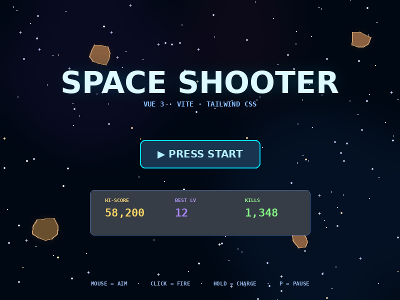
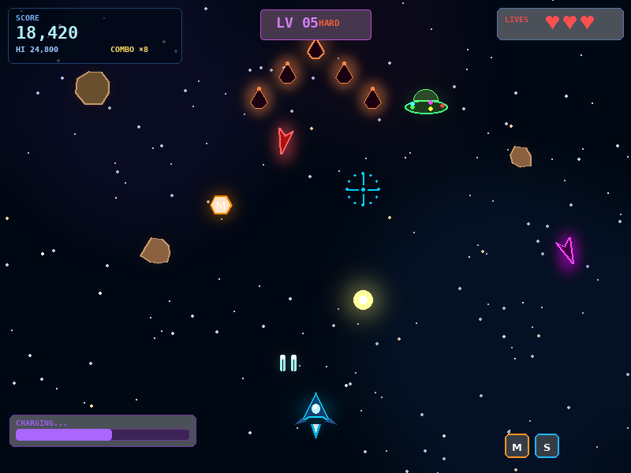
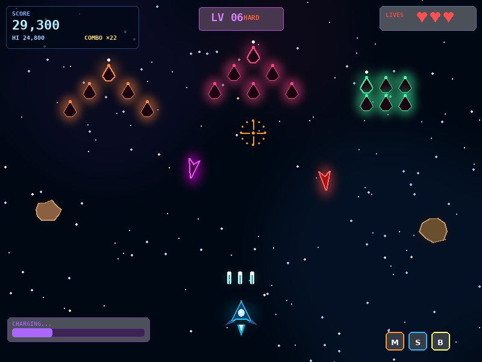
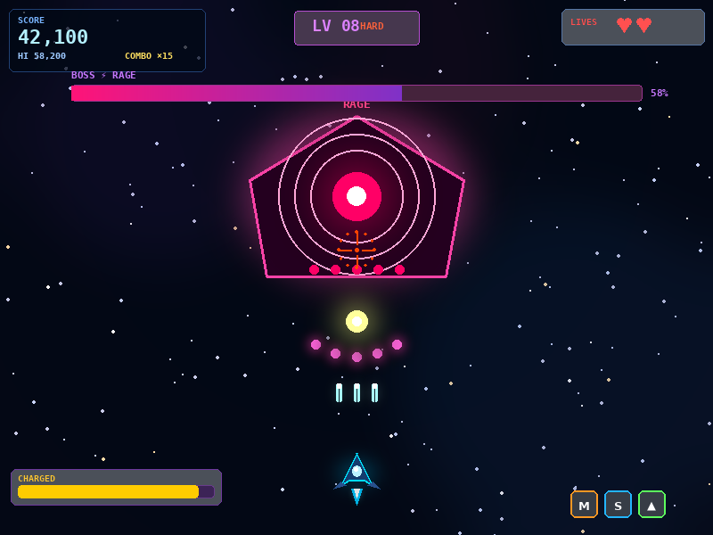
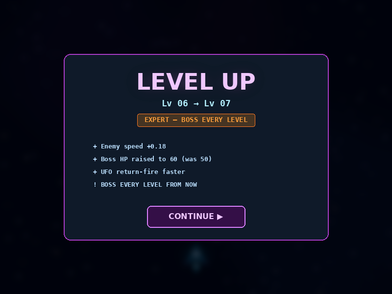
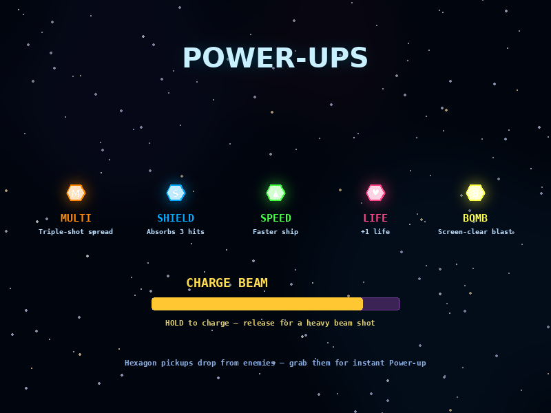

# 🚀 Space Shooter

เกมยิงยานอวกาศ 2D บน Canvas สไตล์ retro-arcade เล่นบนเบราว์เซอร์ ทำด้วย **Vue 3 + Vite + Tailwind CSS** เน้นการเล่นที่ลื่นไหล 60fps พร้อมระบบความยากแบบไต่ระดับ ศัตรูหลายชนิด ระบบ Power-up และ Boss หลายเฟส

---

## 🎮 คำอธิบายเกม

ผู้เล่นจะบังคับยานอวกาศด้วยเมาส์เพื่อหลบหลีกและทำลายศัตรูที่ปรากฏมาเรื่อย ๆ จากด้านบนจอ คะแนนจะเพิ่มขึ้นจากการเก็บ combo ต่อเนื่องและการกำจัดศัตรูชนิดต่าง ๆ เมื่อเล่นไปได้สักระยะระบบจะอัพระดับ (Level Up) ทำให้ศัตรูหลากหลายและก้าวร้าวขึ้น ในด่านที่ยากจะเจอ **Boss** ที่มีหลาย Phase พร้อมรูปแบบการยิงที่ซับซ้อน

จุดเด่นของเกม:

- **5 ระดับความยาก** (EASY → NORMAL → HARD → EXPERT → INSANE) ค่อย ๆ ยากขึ้นแบบ smooth
- **ศัตรู 5 ประเภท** — อุกกาบาต, UFO ซิกแซก, Dart ยิงตรง, Kamikaze พุ่งชน, Formation บินเป็นรูปขบวน (V / Arrow / Grid / Diamond / Pincer)
- **Boss 2 Phase** พร้อม RAGE mode ที่ HP ต่ำ — มี orbit ring, rage particles, telegraph attack
- **Power-up 5 แบบ** — Multi shot, Shield, Speed, +1 Life, Bomb
- **Charge Beam** — กดค้างเพื่อชาร์จลำแสงพลังสูง
- **Combo system** + บันทึก Hi-score, Best level, Total kills ลง localStorage
- **UI สไตล์ Cyberpunk** ทำด้วย Tailwind CSS ทั้งหมด — HUD, Boss bar, Charge meter, overlays

### 🕹️ การควบคุม

| ปุ่ม | การทำงาน |
|------|----------|
| 🖱️ เมาส์ | เล็ง / ขยับยาน |
| คลิกซ้าย | ยิง |
| คลิกค้าง | ชาร์จลำแสง (Charge Beam) |
| `P` / `Esc` | หยุดชั่วคราว |
| 👆 แตะหน้าจอ | รองรับมือถือ |

---

## 📸 Screenshots

### 🚀 หน้าจอเริ่มเกม


### ⚔️ ระหว่างเล่น — ศัตรูหลายชนิด, HUD, Charge Beam, Power-ups


### 👾 Formation Swarm — ศัตรูบินเป็นรูปขบวน V / Arrow / Grid


### 👹 Boss Fight — Phase 2 RAGE Mode


### 🔼 Level Up Screen


### 💎 Power-Up Showcase


---

## 🛠️ Tech Stack

- **Vue 3** Composition API (`ref`, `reactive`, `computed`)
- **Vite 5** — HMR dev server
- **Tailwind CSS v3** — utility classes สำหรับ UI/HUD ทั้งหมด
- **Canvas 2D API** — render เกม, particle system, enemy effects
- **requestAnimationFrame** — game loop 60fps
- **localStorage** — บันทึก highscore, bestLevel, totalKills, bossKills

## ▶️ วิธีรัน

```bash
npm install
npm run dev
```

เปิดเบราว์เซอร์ที่ **http://localhost:5173**

---

## 👥 ผู้รับผิดชอบ (Team & Contribution)

| รหัสนักศึกษา | ชื่อ | รับผิดชอบส่วน | รายละเอียด |
|--------------|------|---------------|------------|
| `67130500081` | **THANAKORN CHAREONLERTKAMOL** | **More Enemies** — ระบบศัตรูหลากหลาย | • Refactor เกมจาก single-file เป็น **composable architecture** (`useEnemies`, `usePlayer`, `useParticles`, `useCollisions`, `usePowerUps`, `useDraw`, `useParallax`, `useStats`)<br>• เพิ่มศัตรูชนิดใหม่: **Formation enemies** บินเป็นรูปขบวน 5 แบบ (V / Arrow / Grid / Diamond / Pincer) พร้อม leader & dive logic<br>• ระบบ **Dart** และ **Kamikaze dart** พุ่งตรงเข้าหาผู้เล่น<br>• **UFO** เคลื่อนแบบ sine-wave + ระบบ shoot-back<br>• ปรับสมดุล spawn rate / wave size / kamikaze chance ตามระดับด่าน<br>• แยก HUD overlays เป็น component (`HUD.vue`, `BossBar.vue`, `PowerUpRow.vue`, `ChargeMeter.vue`, `StartScreen`, `LevelUpScreen`, `BossWarning`, `GameOverScreen`, `PauseScreen`) |
| `67130500056` | **ATCHARAYU TUNYAKAN** | **Tailwind CSS UI** — base game & UI styling | • วางโครงสร้างโปรเจกต์ Vue 3 + Vite + Tailwind v3 ให้ทุกคนใช้ร่วมกัน<br>• ออกแบบและ implement **HUD UI ทั้งหมด** ด้วย Tailwind utility classes (Score panel, Lives, Level badge, Combo display)<br>• ตั้งค่า `tailwind.config.js`, `postcss.config.js`, `style.css` พร้อม custom animation (`animate-flicker`, `animate-shake`, `animate-boss-warn`)<br>• Theme cyberpunk: glow effect, neon border, gradient bar, dark space backdrop<br>• เลย์เอาต์ overlay screens (Start / Game Over / Pause) ให้ responsive และเข้ากับธีม<br>• Player ship + projectile + particle base rendering บน Canvas |
| `67130500040` | **SIWACH SAEOUNG** | **Easier-Boss** — Boss system & Charge Beam | • ออกแบบและพัฒนา **Boss encounter** ทั้ง flow: spawn → entering → phase 1 → **phase 2 (RAGE)** → defeat<br>• ระบบ **Boss HP bar** เปลี่ยนสี/เอฟเฟกต์ตาม phase (orange → purple → red-pink rage gradient)<br>• ปรับสมดุลให้ "Easier Boss" — `bossHp = 18 + lv × 6` (ลดจาก `25 + lv × 10`) ทำให้ผู้เล่นใหม่เข้าถึงง่ายขึ้น<br>• **Charge Beam mechanic** — กดค้างยิ่งนานยิ่งแรง พร้อม cooldown และ visual feedback (`CHARGING / CHARGED / ★ RELEASE!`)<br>• **Boss Warning overlay** ก่อนเข้าฉากบอส<br>• ระบบ tracking `bossKills` / `chargeShots` ลง localStorage<br>• Boss phase-2 effects: orbit rings, rage vignette, RAGE label flicker |

---

## 📁 โครงสร้างไฟล์ (Final Build)

```
src/
├── main.js                              # createApp
├── App.vue                              # root wrapper
├── Game.vue                             # canvas + overlays composition
├── style.css                            # Tailwind + custom animations
├── game/
│   ├── constants.js                     # VW, VH
│   ├── state.js                         # mutable game state
│   ├── store.js                         # reactive refs (level, score, ...)
│   ├── difficulty.js                    # tier table + getDiffParams(lv)
│   ├── useGameLoop.js                   # main RAF loop
│   └── composables/
│       ├── usePlayer.js
│       ├── useEnemies.js                # ★ formations, UFO, dart, kamikaze, boss
│       ├── useParticles.js
│       ├── useParallax.js
│       ├── useCollisions.js
│       ├── usePowerUps.js
│       ├── useDraw.js                   # ★ all canvas rendering
│       └── useStats.js
└── components/
    ├── HUD.vue
    ├── BossBar.vue                      # ★ phase-aware boss bar
    ├── PowerUpRow.vue
    ├── ChargeMeter.vue                  # ★ charge beam UI
    └── overlays/
        ├── StartScreen.vue
        ├── BossWarning.vue              # ★ boss telegraph
        ├── LevelUpScreen.vue
        ├── GameOverScreen.vue
        └── PauseScreen.vue
```

---

## 🧪 ระบบ Difficulty (สรุป)

| ด่าน | ชื่อ | สิ่งใหม่ที่เพิ่ม |
|------|------|------------------|
| 1–2  | **EASY**   | อุกกาบาตช้า, เรียนรู้พื้นฐาน |
| 3–4  | **NORMAL** | UFO เริ่มปรากฏ, Formation enemies, Dart |
| 5–6  | **HARD**   | ศัตรูยิงกลับ, Kamikaze dart |
| 7–9  | **EXPERT** | Boss ทุกด่าน, ยิง 5 ทิศ, Phase 2 |
| 10+  | **INSANE** | ทุกอย่างเร็วและแน่นขึ้น, ไม่มีที่สิ้นสุด |

**สูตร ramp-up หลัก:**
- ความเร็วศัตรู: `0.9 + level × 0.12`
- Spawn interval: `max(600, 2200 - level × 120)` ms
- Wave size: `8 + level × 2`
- Boss HP: `18 + level × 6`
- Power-up drop rate: `min(0.40, 0.32 + level × 0.005)`

---

> Built with Vue 3 + Vite + Tailwind CSS · Canvas 2D · 60fps
